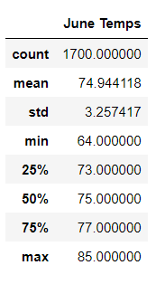
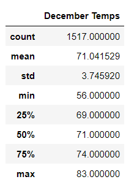

# Hawaii_Temperature_Analysis

## Overview

W. Avy is looking to start a suf shop in Oahu, Hawaii. He specifically wants to sell surfboards and icecream to local tourists and wants us to do an analysis of the local temperature trends in order to have a better understanding of what times of the year toursists are likely to 1. Rent or purchase surfboards and 2. Purchase ice cream.

## Analysis and Results

We started by acquiring the temperature statistics for June by finding all the weather station results from the region, putting them into a dataframe and pulling out the summary statistics for that June dataframe pictured below:

The next process was to do the same with the December temps to achieve a higher view of the peak temperatures through the region.

## Summary
The peak temperatures in Oahu in June and December are typically similar with an average maximum temp of 85°F. At the other extreme the low temperatures for June are still mild while December can get down to 56°F.

Overall the average temperature change between June and December is relatively small. Another set of queries that might benefit analysis is an overall rainfall during the months of June and December to determine how much time tourists might spend outside based on the amount of clear days and second, a query of chances of tropical storms overall throughout the region in order to determine the peak tourist season.